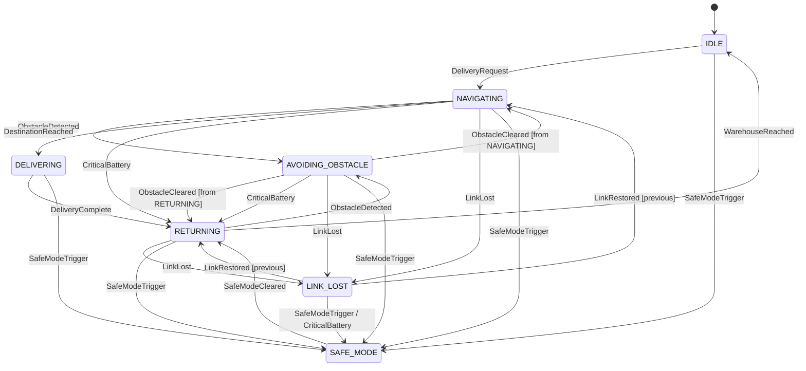

# Task 3 – State Diagram

```mermaid
stateDiagram-v2
    [*] --> IDLE
    IDLE --> NAVIGATING: DeliveryRequest
    NAVIGATING --> AVOIDING_OBSTACLE: ObstacleDetected
    AVOIDING_OBSTACLE --> NAVIGATING: ObstacleCleared [from NAVIGATING]
    AVOIDING_OBSTACLE --> RETURNING: ObstacleCleared [from RETURNING]
    NAVIGATING --> DELIVERING: DestinationReached
    DELIVERING --> RETURNING: DeliveryComplete
    NAVIGATING --> RETURNING: CriticalBattery
    AVOIDING_OBSTACLE --> RETURNING: CriticalBattery
    RETURNING --> AVOIDING_OBSTACLE: ObstacleDetected
    RETURNING --> IDLE: WarehouseReached
    NAVIGATING --> LINK_LOST: LinkLost
    AVOIDING_OBSTACLE --> LINK_LOST: LinkLost
    RETURNING --> LINK_LOST: LinkLost
    LINK_LOST --> NAVIGATING: LinkRestored [previous]
    LINK_LOST --> RETURNING: LinkRestored [previous]
    LINK_LOST --> SAFE_MODE: SafeModeTrigger / CriticalBattery
    IDLE --> SAFE_MODE: SafeModeTrigger
    NAVIGATING --> SAFE_MODE: SafeModeTrigger
    AVOIDING_OBSTACLE --> SAFE_MODE: SafeModeTrigger
    DELIVERING --> SAFE_MODE: SafeModeTrigger
    RETURNING --> SAFE_MODE: SafeModeTrigger
    SAFE_MODE --> RETURNING: SafeModeCleared
```

**Forbidden (not drawn):** IDLE → DELIVERING, AVOIDING_OBSTACLE → DELIVERING
